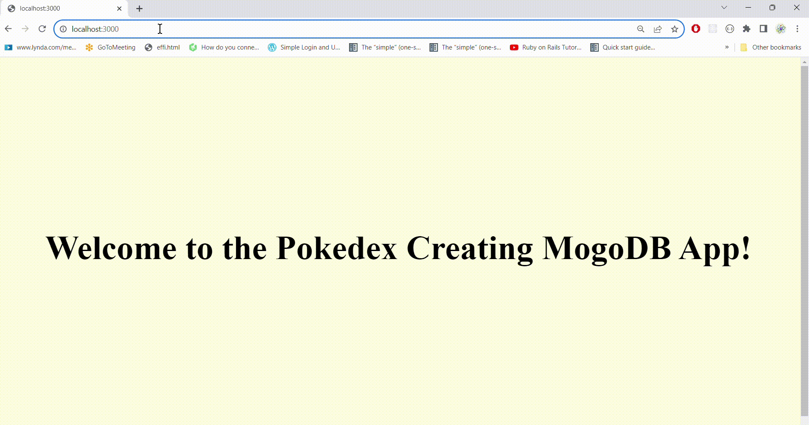

<h1>POKEMONS Creating App Using MongoDB </h1>

<h2>Poke Express</h2>

<h2>Make a Pokemon app that displays data inside server-side rendered views.</h2>

<h4>Learning Objectives</h4>
Practicing index and show, new and create routes with express

<h4>Prerequisites</h4>
<ul>
<li>JavaScript</li>
<li>Express</li>
<li>Node</li>
<li>JSX</li>
<li>MongoDB</li>
  
</ul>

